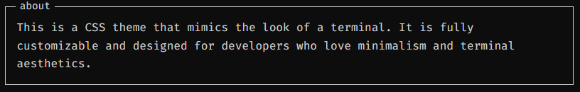

# [👀] Preview

### You can test this theme on [this site](https://ikuza.space/tui-css-theme/)!



# [📥] Installation
### [1] Import immediately in **html**

> [!NOTE]
> Suitable if you do not plan to edit the theme.

```html
<!-- import "tui" -->
<link rel="stylesheet" href="https://raw.githubusercontent.com/lozzyiech/tui-css-theme/main.css"> 
```
### [2] Import in **css**

> [!NOTE]
> Suitable if you want to slightly change/supplement the theme.

```css
/* import "tui" */
@import url("https://raw.githubusercontent.com/lozzyiech/tui-css-theme/main.css")
```
### [3] Install css

> [!NOTE]
> Suitable if you want to change the theme a lot.


1. Download ZIP
2. Extract **css** folder to your project
3. Import all .css files to .html

```html
<!-- import "tui" -->
  <link rel="stylesheet" href="css/base.css" />
  <link rel="stylesheet" href="css/panel.css" />
  <link rel="stylesheet" href="css/layout.css" />
  <link rel="stylesheet" href="css/theme.css" />
  <link rel="stylesheet" href="css/controls.css" />
```
